 DS1 Editor - Documentation         **Diablo II MAP Editor - Documentation**  

* * *

[**Back to Documentation Home**](../README.html)

This is not a complete tutorial explaining all you need to know, but at least I hope it'll cover the most basic questions anyone can have concerning the use of my DS1 Editor, and some more general wondering on Map Concepts.

**Other Docs**

*   [**Tutorial 1**](../02-Tutorials/Tutorial-01-Basic-Map-Editing.html) : advanced map editing stuff (Warps / Map Resizing / Walkable infos / House with Roofs)  
    **\- IN CONSTRUCTION -**

**Revision History**

*   05 March 2006 : Deletion of Tiles and Objects are now using the **DEL** keys. **CTRL** \+ **X** is now for Cut'n Paste
*   14 November 2005 : Added Tile Grid ( **G** ) and BIG Screenshot ( **SHIFT** \+ **P** )
*   19 Jully 2004 : Added **Tilde** and **CTRL** \+ **1** ~ **CTRL** \+ **0** sections, to support the edition of up to 100 ds1
*   26 March 2004 : Improved the Advanced tile editing (bitfield) window
*   10 March 2004 : Added Paths Editing
*   29 Jully 2003 : Started Tutorial 1
*   22 June 2003 : Added exemples for the **mod\_dir** line in the **Ds1edit.ini** , thanks to **NewbieModder** .

**What's inside the win\_ds1edit.zip**

win\_ds1edit.exe

The editor itself

\*.bat

The BATCH files that launch the editor and give it parameters

\*.ds1

The Map themselves

Ds1edit.ini

The configuration file of the editor

demo.ini

An exemple to show how opening severall ds1 in the editor at once

Readme.txt

The basic doc

Data\\

Contains some ressources necessary for the editor

Pcx\\

Contains some graphical ressources for the editor

 

 

Data\\tmp\\

Directory for temporary Undo datas

Data\\gamma.dat

Tables of Gamma correction, ressource of the editor

Data\\ds1edit.dt1

Description of the Special Tiles used by the game (not complete)

 

 

Data\\obj.txt

A tabulated Text File that can be open in Excel, datas of objects spawnable in a map. This file is needed in order to have animations and name of the objects in the editor, and is subject to be updated every now and then

**Installing the Editor**

1.  Extract the **win\_ds1edit.zip** somewhere on your hard disk, its location is not important. Then, extract the **alleg403.zip** in that directory (the **alleg40.dll** must be at the same place of the **win\_ds1edit.exe** ).  
      
      
    
2.  Now, edit **Ds1edit.ini** .  
      
    
    1.  Edit the **d2char**, **d2data** , **d2exp** and **patch\_d2** lines in order to indicate the place where your corresponding MPQ are.  
          
        
    2.  The **mod\_dir** works the same way as when making a Mod using the -direct -txt method. It is optional. If you're using a modified data\\global\\excel\\LvlTypes.txt for you Mod for instance, you don't have to put it in patch\_d2.mpq each time you're modifying it, just use that mod\_dir line to indicates to the editor that you have a Mod directory. All files in the Mod directory are the one the editor take by default (if present). It'll search them in the usual MPQ only if it don't find them first in the Mod Directory.  
          
          
        For instance, if you have your .TXT files in **C:\\Program Files\\Diablo II\\data\\global\\excel\\** , the **mod\_dir** path would be :  
          
                mod\_dir = C:\\Program Files\\diablo II  
          
          
          
        If you have your .TXT files in **H:\\game\\Diablo II\\d2 mods\\my\_mod\\data\\global\\excel\\** , the **mod\_dir** path would be :  
          
                mod\_dir = H:\\game\\Diablo II\\d2 mods\\my\_mod  
          
          
          
        
    3.  If you want to work in another screen mode, edit the **full\_screen** , **screen\_width** , **screen\_height** and **screen\_depth** lines. Try to not use a mode below 800\*600 tough. The screen\_depth has no influence on the quality of the images (yet), so leave it to 8.  
          
        
    4.  If you want to increase your fps, and assuming that your video card and monitor can support it, you can ask to use a different monitor refresh rate. For instance when editing Tristram, and with the refresh rate set to 60, I have an average of 35 fps. Since I know that my video card have a mode of 800\*600 256 colors at 120 Hz, I change that **refresh\_rate** line to be 120, and then when editing Tristram again, I now have an average of 69 fps. Keep in mind than the game is using a rate of 25 fps in any case tough. If the editor can't find a mode matching your refresh rate, it'll take a default one, usually 60hZ. The value that is really used is indicated in the editor, at the bottom / right corner  
          
        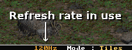  
          
          
        
    5.  There are other options in the ds1edit.ini, but they're user preferences, not essential configuration to make the editor works. Just read the comments in the .ini to know what you can change.
    
3.  Now you're ready. Just launch a .bat (like **Tristram.bat** ) and the editor will first load the datas it needs (essentially from the MPQ), and then allow you to edit Tiles of Tristram, or editing Objects (click on the images to enlarge them) :  
      
    
    
    
    [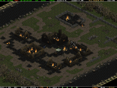](#)
    
     
    
    Command line output of the Editor while loading its various datas
    
    Ready to work
    
      
      
    

  
  
  
**Working with the Editor**

This editor is using essentially the keyboard and the mouse together. There's no menus, all of the command are done by the keyboard. In this documentation, you can click on almost all images to enlarge them.  

* * *

**ESC**

Quit the Editor. For confirmation, a window will appear to ask you to save or not the current ds1 you're editing.

  

* * *

**TAB**

Change current Editing Mode (Tile / Objects / Paths). The current mode is writen on the bottom / right corner.

 

 

[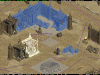](#)

[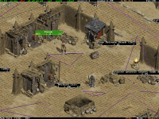](#)

 

Editing Tiles

Editing Objects

 

  
  
  

 

 

 

 

[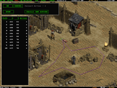](#)

 

Editing Paths

  

* * *

**F1** , **F2**

Toggle Floor layers 1 and 2 :

 

  

  

 

[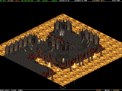](#)

[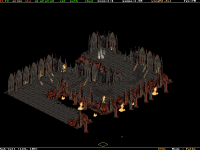](#)

 

F1 and F2 activate

F1 disable

 

  
  
  

 

 

 

  

  

 

[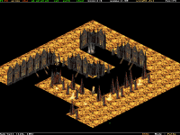](#)

[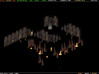](#)

 

F2 disable

Both F1 and F2 disable

  

* * *

**F3**

Toggle Animations layer (3 modes : none, freeze, animate). Objects can be hidden by walls so you may miss some of them, but in the Object Editing Mode this problem can't occur, since they all have a "Label" which is draw on top of the Tiles. Exemples of the 3 possible modes :  
  

 

 

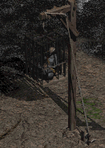

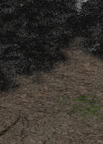

 

Animate

Freeze

None

  

* * *

**F4**

Toggle Object infos layer. 4 modes : none, "Type,Id", Animation Speed, Name in Obj.txt :

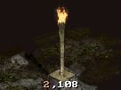

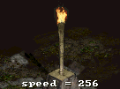

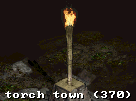

None

Type,ID

Animation Speed

Name in Obj.txt

  

* * *

**R**

**R** efresh the obj.txt. It'll read it again, and then update all the animations. Usefull while editing the Data\\obj.txt to see immediatly the modification results in the editor  
  

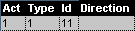

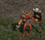

Current animations in the Editor, the animation use the Direction 0 by default

  
  

  
  
  

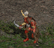

Changing a value in Data\\obj.txt, and result after a Refresh in the Editor

  

* * *

**F5** , **F6**, **F7** , **F8**

Toggle wall layers. Like for the Floor layers, you can toggle all wall layers. **F5** is for the Wall layer 1, **F6** for the Wall layer 2, and so on :

 

      

      

 

[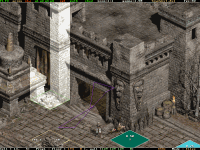](#)

[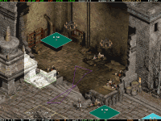](#)

 

With the Wall layer 3 activate

With the Wall layer 3 disable

  

* * *

**F9**

Toggle Special Tiles drawing priority. 2 modes : draw like walls, or draw on top of all gfx (like roofs). It allows to see Special Tiles hidden by Walls. On the 2 precedent images you can see that the upper Green Special Tile is only visible when the Wall layer 3 is disable. That's because for this screenshots the Special Tiles drawing priority was set to draw Special Tiles \* like walls \*, thus the upper Green tiles was hidden. Now, let's hit the **F9** key and here's what we have :

[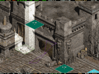](#)

Special Tiles draw like Walls

Special Tiles draw like Roofs

  

* * *

**F10**

Toggle npc's paths layer (**not yet editable**). The NPC in the game will only use the points on the Pink lines (and randomly), and they'll never go back to their original starting position.

[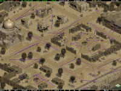](#)

[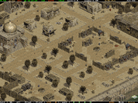](#)

Lots of NPC paths in Lut Gholein

NPC paths hidden

  

* * *

**F11**

Toggle the Shadow Layer. There are 4 Shadow modes : Disable, "As-is" (solid, original colors), White (all pixels are replace by White pixels), and Transparent (this is the default value). In the game you have the choice between 2 quality for the Shadows, in the editor their correspondances are the "As-is" and the Translucent modes.

 

 

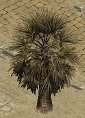

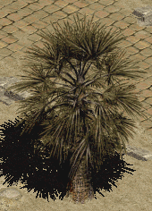

 

Disable

"As-is"

 

  
  
  

 

 

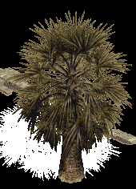

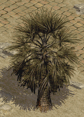

 

White, that way it's far easier  
to see them in some case,  
like when there's no Floor layer

Translucent

  

* * *

**SPACE**

Toggle walkable info layer, 3 states : disable (default), simple infos (walkable & jump infos only), complete infos. In this state a little help window appear at the bottom / right corner (it's toggleable by the **T** key).

 

[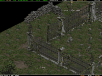](#)

[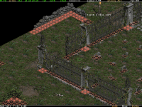](#)

 

No walkable infos

Simple walkable infos

 

  
  
  

 

[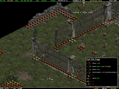](#)

[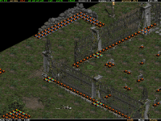](#)

 

Complete walkable infos,  
help window activate

Complete walkable infos,  
help window disable

  

* * *

**G**

**Shift** \+ **G**

Toggle the Tile Grid state between the 3 available : disabled, over floors but under walls, and over floors and walls. If the **Shift** key is pressed it do the same but in reverse order.

 

[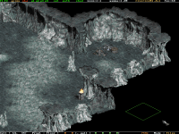](#)

[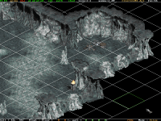](#)

 

Tile Grid disabled

Tile Grid over floors, but under walls

 

  
  
  

 

 

 

[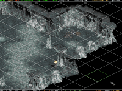](#)

 

Tile Grid over floors and walls

  

* * *

**Shift** \+ **F1** ~ **F2**  
**Shift** \+ **F5** ~ **F8**  
**Shift** \+ **F11**

View only this layer. It's an easy way to check which tiles are on which layers : Press **Shift** , then press **F1** to see what are the Tiles of the Floor layer 1, keep **Shift** press and type **F2** and you're now viewing only the Tiles of the Floor layer 2, and so on.

It's especially usefull if you want to select some Walls but without Floors that are below for instance : press **Shift** and hit the **F5** key, and you're now able to select only the tiles that are on the wall layer 1, without the floors.

  

* * *

**Ctrl** \+ **F1** ~ **F2**  
**Ctrl** \+ **F5** ~ **F8**  
**Ctrl** \+ **F11**

That's the reverse of the precedent command : it will make all layers visible, except the one you have the key on.

The Shift + ... and the Ctrl + ... commands are shortcuts, since you can achieve the same results by pressing where needed the keys F1, F2, F5, F6, F7, F8 and / or F11. But it's more simple and quicker that way.

  

* * *

**Backspace**

Reset all layers states to their default value. So if you're lost in knowing what layers are disable, just press this key and all Floor / Walls / Shadow layers will become visible again.

I'm usually using it that way : Shift + ... to view only 1 layer, then I select the tiles I want on that layer, then I press Backspace to view back all layers.

  

* * *

**Tilde**

That's the key that is on the upper/left corner of your keyboard. It toggles (hide / show) an optional 2nd row to the menu bar. This row display the current SET (group) of DS1, the current DS1 index that you are on, and the full path of this DS1 (see below).

  

* * *

**CTRL + 0** ~  
**CTRL + 9**

0 ~ 9 are the keys that are in the upper part of your keyboard, not in the keypad.

When more than 10 DS1 are loaded (via a .ini) the editor split them into 10 different SETS, from SET 1 (CTRL + 1) to SET 10 (CTRL + 0). In each SET you have the usual 10 slots of DS1. SET 1 contain DS1 #1 to #10, SET 2 contains DS1 #11 to #20 ... up to SET 10 that contains DS1 #91 to #100.

For instance, to copy tiles from DS1 #22 to DS1 #84 you'll do :

*   **CTRL + 3** (enter SET 3, it contains DS1 #21 to #30)
*   **2** (activate DS1 2 of SET 3, so it's DS1 index : 10\*(3-1)+2 = 20 + 2 = 22)
*   select your tiles and copy them ( **CTRL + C** )
*   **CTRL + 9** (enter SET 9, it contains DS1 #81 to #90)
*   **4** (activate DS1 4 of SET 9, so it's DS1 index : 10\*(9-1)+4 = 80 + 4 = 84)
*   place your tiles

Note : when more than 10 DS1 are loaded, the menu bar contains 2 rows, as an  
additional row appear to help you to navigate through the different DS1s. This 2nd row display the current SET (group) of DS1, the current DS1 index that you are on, and the full path of this DS1.

When is it usefull to load that many DS1 ? Well, a maze of an area is composed of usually 72 DS1, so this is the time to use this functionallity. Onyx used 84 DS1 for his replacment of the Act 3 dungeon ;)

  

* * *

**0** ~ **9**

That's the keys that are in the upper part of your keyboard, not in the keypad. It makes you switch between all the 10 possible maps of the current SET (group) of ds1, assuming you are using the multiple-ds1 editing fonctionality of the editor. Check the README.txt that is in the zip of the editor for details on how loading more than one map at once.

  

* * *

**F12**  
**Shift** \+ **F12**

More (or Less if Shift is pressed) Gamma Correction. In dark areas you may want to increase that value (act 3 usually), while in the bright areas you may want to decrease it (Act 2). The default value is 1.00 and it is the value to use to display all images in their original colors. Depending of your video card / monitor / video mode / your own eyes / or whatever else, you'll find a value that fit your needs in most of the case. In order to avoid you to change that value each time you're launching the editor, edit the **ds1edit.ini** configuration file, at the line **gamma\_correction**.

  

* * *

**Up** , **Down** , **Left** , **Right**

**Mouse** on the borders of the screen

You can scroll the main editing window by pressing the arrow keys. And you can also place your mouse exactly on the 4 sides of the screen to achieve almost the same result.

The scrolling speed when using the arrow keys is in the **ds1edit.ini**, as long as the scrolling speed when using the mouse. If your computer is too old / too powerfull, or simply if you don't like the default scrolling speeds, adjust these values in the .ini to fit your needs.

  

* * *

**+** , **\-** (keypad)

**\-** , **\=**

**Mouse wheel**

Hit the **+** and **\-** keys to zoom in or out. You can only use the internal zooms (which are powers of 2) : **1:1**, **1:2**, **1:4**, **1:8** and **1:16**. You can use both the keys on the keypad, and / or the keys between the keys **0** and the **Backspace** . With these keys, the zoom is always done on the Tile / Sub-Tile which is at the center of the screen.

You can also use the **Mouse Wheel** for zooming : roll it forward and you're zooming IN, roll it backward and you're zooming OUT.

  

* * *

**C**

**Mouse  
button 3**

Center the map to the Tile (or the Sub-Tile) the mouse is pointing. It also automatically set the zoom to the value defined in **ds1edit.ini** right after (check the line **center\_zoom** in that .ini)

You can also use the Mouse button 3, which should be the Roller while you're pressing - not rolling - it. Press the Mouse Roller, then roll it either forward or backward, and you're zooming **and** centering the map to the Tile / Sub-Tile the mouse is on.

  

* * *

**Home**

At any moment, if you're lost in the map (than can happen if you're playing with both scrolling and zooming), hit the **Home** key and you'll be on the center of the map again.

  

* * *

**P**

**Shift** \+ **P**

**P** rintscreen (makes a screenshot). They're .pcx, and have names like "**screenshot-00037.pcx**". They're created into the directory of the editor. The editor will never erased a previous screenshot, it'll always search for the next unused number.

If the **Shift** key is pressed, it'll make a BIG screenshot, and you'll have the **entire** map in 1 image. Note that this big screenshot takes care of the current zoom and various graphical layer state. In addition, the format of this screenshot is in .BMP instead of .PCX, because of the .PCX image dimensions limitations.

  

* * *

**Left Click  
**

Maintain the Left Mouse button pressed, and you're now **selecting an area of Tiles** : move the mouse around and you'll change the Tiles that will be selected.

When you're releasing the mouse button, different actions can be made, depending of the key that is pressed :

 

no key

: make a new selection

 

**Shift**

: add the area to the previous selection

 

**Ctrl**

: remove the area from the previous selection

 

**H**

: hide the current visible Tiles of the area (usefull to see behind)

The selection is based on **what you're seeing** . By changing the Layer's state (using the keys **F1** , **F2** , **F5** , **F6** , **F7** , **F8** , **F11** ), you can select / deselect a Floor, a Wall, a Shadow, multiple Floors / Walls / Shadows, etc...

Tip : you can press the left button, then toggle your layers, then make your area selection just like you want, then toggle the layers visibility, press an action key to make a command ( **Shift** , **Ctrl** or **H** ) and released the left button only at the end. Most of the command still work while selecting an area.

Hidding Tiles is safe. They're not deleted from the map, this is just a temporay state : press the **S** key (like **'S'**how), and all the hidding tiles of the map will be visible again. Hidding Tiles is usefull to see what are the other Tiles that are behind. Note that even if they're hidden, they can still be selected / deselected when making an area : the selection process of the Tiles is based on the global Layer visibility only, not the Hidden state of individual Tiles.  

Let's exercise a little :

 

[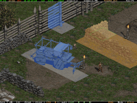](#)

[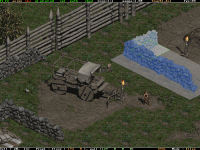](#)

 

We already have a selection composed of 2 parts (the blue Tiles), and are now selecting a new area (the orange Tiles)

If when releasing the Left mouse button no key is pressed, then the area will become a **New** selection

 

  
  
  

 

[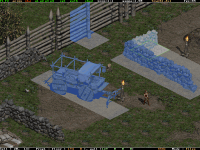](#)

[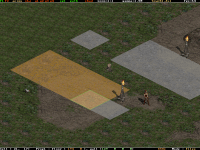](#)

 

Let's come back in past and let's press the **Shift** key instead of having no key when releasing the Left mouse button : we're adding the area to the existing selection

Now, let's delete from the selection the Floor Tiles that are under the vehicle. Press **Shift** \+ **F1** to only see the Floor layer 1. Then makes an area that includes that Tiles...

 

  
  
  

 

[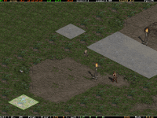](#)

[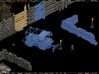](#)

 

... and press **Ctrl** before releasing the Left mouse button : you have excluded the current Tiles of that area from the selection (but only the ones on the Floor layer 1, since only this layer was visible)

Now, press **Shift** \+ **F5** to only see the Wall layer 1. Then select a new Tile of that layer, press **Shift** , release the Left mouse button and...

 

  
  
  

 

[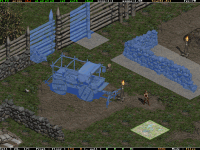](#)

[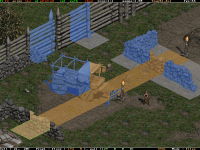](#)

 

...and you have added a new Wall (but not the Floor) to the selection. Press **Backspace** to view all layers : you can see that the vehicle don't have its Floor tiles selected, since we have excluded them from the selection just before.

Now let's try to Hide some Tiles. Make this area but _keep the Left mouse button pressed for now_.

 

  
  
  

 

[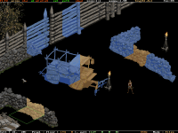](#)

[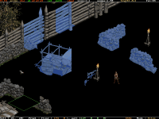](#)

 

Now, press **Shift** \+ **F5** to see only the Wall layer 1. What ? Yes, keep the Left mouse button pressed. Yes you can. As for me, I can press the **Right Shift** \+ **F1** while using only my Left hand.

Now, press the **H** button and release the Left mouse button : you have Hide some Tiles. But since only the Wall layer 1 was visible, the \* Floor \* Tiles were not hiden.

 

  
  
  

 

[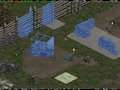](#)

 

As a proof, just hit the **Backspace** key, to make all layers visible again : only the Tiles on the Wall layer 1 of your last area are hidden, not the Floor Tiles.

Now, just press the **S** key, and the hidden Tiles are visible again : they were not deleted from the map.

  
  
To be honest, the possibility to change the Layers visibilty while making an area was not done on purpose, it's a side effect that you can use, but I don't think someone will really need it. It can be usefull in some cases, but not often. So just remember these important points :

*   Selecting Tiles : press the Left mouse button, make your area, press a command Key (if needed), and release the button.  
      
    
*   At any moment, if you're lost in your layers visibility and or / hidden Tiles, press **Backspace** then **S** : all Tiles are now visible again.

  

* * *

**I**

A powerfull command : select all **I** dentical tiles in the map, as the ones you're clicking the mouse onto.

Choose a Floor, press the **I** key and maintened it pressed, click on the floor, and all the same floors on the whole map are selected (even if they're on another layers). This can work even if there are several tiles on the cell, in that case you'll have a selection composed of several type of tiles.

Another usefull thing is that you can still use the **Shift** and **Ctrl** key to respectively add all these tiles to the current selection, or delete them all from the selection : choose a cell which have only 1 floor, select all the same floors with the **I** key. Now, choose another floor, but press **Shift** \+ **I** : you'll have in your large selection 2 type of Floors now. Press **Ctrl** \+ **I** and click on one floor of the selection, and you'll have only 1 type of floor in the selection.

The Tiles types that will be searched are based on the visibility of the layers, but the search (in the whole map) to select them is done disregarding the Layer visibility, and even on hidden tiles.

This command is also usefull to have an idea about the density of some tiles in the map. Tip : you can keep the **I** key pressed while moving the mouse on different Tiles... you'll make new selection each time very quickly, thus you'll be able to analyse their density very quickly.

But let's make some exercises, to help you clarify how this command is working :

 

[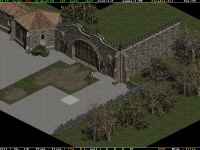](#)

 

Let's say that we already have a selection. Now, go on another Floor Tile, press the **I** key, maintained it pressed, and now click on the Left mouse button...

... you obtain a New selection, composed of all the Floor Tiles on this map that are exactly the same as the one you requested.

 

  
  
  

 

[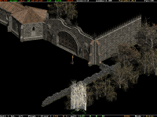](#)

[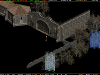](#)

 

Now press **Shift** \+ **F5** to view only the Wall layer 1. Then go on a Tile of this layer...

... press **Shift** \+ **I** and click on the Left mouse button : you have added all the Tiles on the map of that Type to your previous selection...

 

  
  
  

 

[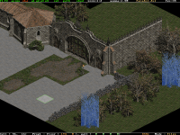](#)

[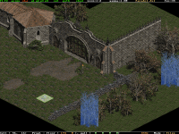](#)

 

... but since only the Wall layer 1 was visible, you only added the Wall Tile, not the Floor Tile that was under, as an hit on the **Backspace** key will confirm you. Now, go on a Floor Tile of the selection...

... press **Ctrl** \+ **I** , and click on the Left mouse button : you have removed all the Floor Tiles of that type from the selection.

 

  
  
  

 

[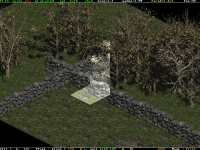](#)

 

Now let's go elsewhere, exactly here, where there are 3 Tiles in that cell : a Floor on the **f1** layer, a Stone Wall on the **w1** layer, and the Left part of a Tree on the **w2** layer. Press **I** and click on the left mouse button...

... you have made a New selection, composed of 3 different types of Tiles, because there were 3 kind of Tiles on your cell, and all 3 were visible when you asked to select the **I**dentical Tiles.

 

  
  
  

 

 

Now, press **Shift** \+ **F5** to view only the Wall layer 1, go on the Middle part of the Tree, press **Shift** \+ **I** and click on the Left mouse button...

... you have added all the middle part of this Tree to the selection, on the whole map. Add again the Right part of the Tree ( **Shift** \+ **I** on the Tile of the Right part) ...

 

  
  
  

 

 

... press **Backspace** to view all layers, and  
check at the opposite of the map : as  
expected you have added all the identical  
Trees of that map to your selection, and  
only the Tree, not its Floor Tile.

  

* * *

**Ctrl** \+ **S**

**S** ave the map (the .DS1), in its current state. Incremental backups. First, it rename the current .DS1 to the first free name with numbers it found, then it save the current map.

For instance, say that you are editing the map **duriel.ds1** for the first time. When you'll ask to save it, it'll rename **duriel.ds1** to **duriel-000.ds1** and save the current state of the map into the file **duriel.ds1**.

Next time you'll make a save, it'll rename **duriel.ds1** to **duriel-001.ds1** and save the current state of the map into the file **duriel.ds1**.

So, the **duriel-000.ds1** is always you original .ds1, and the next numbers are the following versions. Your last version is always the **duriel.ds1**, without the numbers in the name. Numbers are for backups.

  

* * *

**Ctrl** \+ **U**

**U** ndo the precedent **Tiles** modifications, up to the very start. Note that when you make some multiple undo and then start to make new modifications, the undo buffers are reseted : the ones you have just used to get back to the current state of the map are lost. Also you can't undo an undo : there's only 1 way of undo.

The editor is using its directory **data\\tmp** to store temporary files. They're small and are deleted when you're exiting the editor.

  

* * *

**N**

Use a **N** ight preview. 2 modes : lowest quality, better quality. This is just a toy for now, as it don't support any ambient light level / light radius modifications, but it can help you to figure how a map will look in Dark Areas (llike Caves, Crypts, or simply an outdoor area at Night time).

While in Tile / Object / Path mode, press **N** and you're in the Night preview lowest quality (Night 1). Press again **N** and this time you're in the better quality (Night 2). To exit one of the 2 Night preview modes, presse **Tab** , or press **N** until you go back to the original editing mode.

 

 

In an editing mode

Press **N** and you're in the Night preview mode, lowest quality

 

  
  
  

 

 

Press **N** again and you're in the  
Night preview mode, better quality

  

* * *

**Ctrl** \+ **C**

**C** opy the current selection. Right after you have pressed these keys, a preview appear, folowing your mouse mouvements. The **Red** part of this preview tell that you will erase previous tiles at that particular place, **Green** part indicate that the tiles are the same or there were no tiles before.

If you try to copy / paste some tiles from a ds1 to another, you can expect big distorsions. If you want to avoid them, only copy / paste between ds1 that have the exact same ID (in **data\\global\\excel\\lvlTypes.txt**), and the exact same DEF (in **data\\global\\excel\\lvlPrest.txt**). This is the way the game use tiles that make difficult the use of certain tiles in another .DS1.

 

 

First, select this Tent.  
Then press **Ctrl** \+ **C** ...

... and a preview of the selection appear, following your mouse movments. If we place the Tent here, some Tiles will be deleted, as the Red Tiles are indicating

 

  
  
  

 

 

But here it'll be fine, since all Tiles are Green. Let's click the Left mouse button

The result after the copy/paste

  

* * *

**Ctrl** \+ **X**

Cut'n paste. Almost the same as **Ctrl** \+ **C** , except that this time you're NOT moving a COPY, but the ORIGINAL selection of tiles.

 

 

Select this Tree and its shadow.  
Then press **Ctrl** \+ **X** ...

... and a preview of the selection appear, following your mouse movments. If we place the Tree here, some Tiles will be deleted, as the Red Tiles are indicating

 

  
  
  

 

 

But here it'll be fine, since all Tiles are Green. Let's click the Left mouse button

The result after the cut'n paste

  

* * *

**DEL** (keyboard)  
**DEL** (keypad)

Select some tiles, even in different layers, then press **DEL** to delete them.

After a Copy, a Deletion or a modification of the Selection, if you want to cancel your actions and come to a precedent state, don't forget to use the **Ctrl** \+ **U** (Undo) feature.

As an exercice that combine both Copy and Deletion, let's increase the size of the Baal Throne Room :

 

 

Select this border

Press **Ctrl** \+ **C** to copy it, then place the preview here

 

  
  
  

 

 

**Click** on the **Left mouse button** to drop the preview in place

Now reselect the previous border

 

  
  
  

 

 

And press **DEL** to delete it

Select these 2 "lines" of Tiles

 

  
  
  

 

 

**Ctrl** \+ **C** to copy it a first time here

Immediatly after having drop the preview, press again **Ctrl** \+ **C** to copy it a second time here

 

  
  
  

 

 

Press **Ctrl** \+ **C** again for a last copy here

That's done, you now have a bigger Throne Room. Of course it's far from perfect, just check the Walls on the upper/right border : they're not making a good sequence of Tiles.

  

* * *

"Weird" Tiles

Sometimes you may see some Tiles with numbers in there, at zoom 1:1. That's the way the editor show you that there ARE Tiles somewhere, but they have a Flag that make them invisible in the game. That's also to allow you to select them.

It can be some Tiles that are on each side of a River, or tiles to block your way like in Haroggath. But you can also see them on almost ALL maps of the game, at the far Top and Bottom corner, like in the screenshot below. I strongly recommand to leave these last ones in the map, as it seems they're used by the game.

 

 

Invisible Tiles near a River

Invisible Tiles on each side of a Map

  
"Weird" Tiles are mostly unknown in fact, so don't play with them.

  

* * *

**Ctrl** \+ **Shift \+ **Right Click****

Advanced tile editing. **Warning** : NO UNDO IS POSSIBLE !

There are 2 possible windows. It depends if you have a selection of tiles (even just 1 tile of 1 layer) or not. In the case there's a selection, the possible bits to edit are restricted to the tiles inside that selection.

*   When there's no tile selected at all, in the Tile Editing mode, press the **Ctrl** and the **Shift** key, then click on the **Right mouse button** , and this window appear :

> Here you can change all the internal datas of the Tiles, even some unknown. Usually you'll only edit the **Hidden** or the **Unwalkable** bits for a particular Tile.
> 
> For instance in the screenshot, if the Vis special tile on the W1 layer has the Hidden bit set, this is because this warp is not part of the Vis special tile, and therefore the Vis has no graphics, at all. In order to don't see a Green Tile in the game, we tell the game this tile is invisible.
> 
> If you set the Unwalkable bit to 1, then the entire Tile becomes unwalkable, This is usefull to makes floor unwalkable without having to play with DT1 walkable infos. 

*   When there's a selection, the window that will appear is globaly the same, but there are more colors.
    
    > **0** or **1** indicates that all tiles are using the same bit value.
    > 
    > **0** or **1** indicates that some tiles are using a 0, others a 1. If you don't edit this kind of bit, the tiles keep their original values. If you edit it, all tiles will use your new values (and the bit will no longer be **blue** but **white** as well).
    > 
    > **\-** indicates that this bit is not editable, since no tile in the selection is on this layer
    > 
    > Let's say that we want to make several tiles unwalkable at once :
    

 

 

Select the 3 groups of tiles, then press the **Space** key to see the walkable infos. Here these 3 groups are walkable for now. Now, press the **Ctrl** and the **Shift** key, then click on the **Right mouse button** ...

...and this new window appear. Set the **Walkable** bit to **1** for the **F1** layer, and click on the **OK** button (or press the **Enter** key).

 

  
  
  

 

 

This has set all the tiles on the **F1** layer of the selection to have the bit **Walkable** set to **1** , so all the 3 groups are now unwalkable.

  

* * *

Path Editing

The paths editing is still very basic, but with patience it's posible to do what you want.

In short : you select 1 and only 1 object in the Object Editing mode. It can be either a Type 1 or a Type 2 object, but only Type 1 (Monster / NPC) objects can use paths in the game. You then click on the ALL NEW button to delete the current paths and create new ones, by clicking on the map. To change the (hardcoded) "Action" (animation and / or sound) that the NPC will do at a particular place, click on the (Enter) SET ACTION button and type a number in the keypad, then press the **Enter** key and the next paths that you'll place will use that new Action value. When you have finished, click on the OK button, and the NPC have now whole new Paths.

 

 

Select 1 and only 1 object in the Object Editing mode (either the Label or the Feet of the object will work), then press **TAB** to go into the Path editing mode.

You can still use the usual layer toggle and **Space** key if you want. Click on the ADD NEW button and now click some times on the ground, this create new paths.

 

  
  
  

 

 

Click on the (Enter) SET ACTION button, this open a window where you type a number that will be used as the default values for the next paths to adds. Press **Enter** to close the window.

Continue to click on the ground : as you see the new paths are using that new Action default value.

 

  
  
  

 

 

Continue to adds paths and to change the Action values, until you consider that you have finished to add new paths.

At any moment, if you're not satisfy with your changes, click on the CANCEL button to restore the original NPC paths. If it's good for you, click on the OK button, it saves your paths editing and assign them to the NPC.