 Diablo II DS1 (map) Editor - Download Page       **Diablo II MAP Editor**                      By  **P aul**  **SIRAMY**

* * *

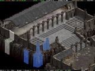  
[Overview : Layer toggle, zoom, multi-selection](#)  
  
     
 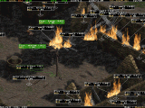  
[Objects editing](#) 

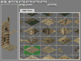  
[Tiles editing](#) 

 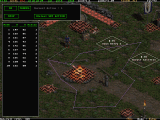 [Paths editing](#) 

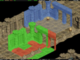  
[Copy/paste Tiles : useful real-time preview](#)  
   
     
 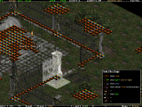  
[View accurate infos of Tiles](#)  
   
     
 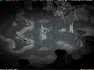  
[A toy : Night preview](#)  
  
  
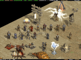  
[Objects are almost like in the Game](#)

 

Main ZIPs

>   
> 
> Compiled with **Microsoft Visual C++ 2010** and using the library **Allegro v 4.4.2** .  
> [**win\_ds1edit\_20111030.zip**](#) (5.76 MB), 05 November 2011
> 
>   
> 
> Just in case, an older version : compiled with **Microsoft Visual C++ 7.0** and using the library **Allegro v 4.2.1** .  
> [**win\_ds1edit\_20070423.zip**](#) (607 kB), 23 April 2007
> 
>   
> 
> **Don't forget to read the **README.TXT** that tells how the editor works.**
> 
> To see a better **documentation** than the README.TXT, check this [documentation page](#) as it contains screenshots and small tutorials.

* * *

Stand-alone DEMO version

> If you don't have the game Diablo II, but still want to try the editor, then you have to use this special package. It is composed of the regular editor's files, an additional directory that contains a selection of graphical files, and a modified ds1edit.ini.

*   Get the zip file : [**win\_ds1edit\_demo.zip**](#) (4.83 MB), 23 April 2007
*   Un-zip it somewhere on your hard-disk (keep the directory structure when extracting **!**)
*   You should obtain something like this :

> >   
> > 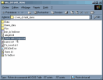  
> > [(enlarge picture)](#)  

*   Double-click on the "**Demo with 2 maps.bat**" file, and the editor is initialising :

> >   
> > 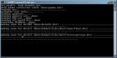  
> > [(enlarge picture)](#)  

*   When it has finished you can fully edit **Tristram** and the **Cairn Stones** maps :

>  
> 
> 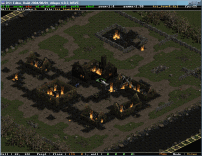  
> [(enlarge picture)](#)
> 
>  
> 
>   
> [(enlarge picture)](#)

* * *

Source Code (Microsoft Visual C++ 2010, Allegro 4.4.2)

> [**win\_ds1edit\_20111030\_src.zip**](#) (160 kB), 05 November 2011, **25326** lines of code

* * *

Links

> **[Main link](http://d2mods.com/forum/viewtopic.php?t=44)**, ds1edit (in the Phrozen Keep's Tools Forum)
> 
> **[Win32 version](http://d2mods.com/forum/viewtopic.php?t=1316)**, win\_ds1edit, console version, all Windows platform
> 
> If troubles, try to check **[here](http://d2mods.com/forum/viewtopic.php?t=270)**
> 
> [**General help**](http://d2mods.com/forum/viewtopic.php?t=724#5563)

* * *

Contact : [siramy\_paul@yahoo.com](mailto:siramy_paul@yahoo.com)