 Ds1 Editor - Tutorial 1         **Ds1 Editor \- Tutorial 1**  

* * *

Back to the main [**Documentation Page**](../01-Getting-Started/DS1-Editor-Complete-Documentation.html)

**Overview**

This tutorial will explain step by step how to work with some advanced stuff of Map Editing :

*   Adding 3 different kind of Warps between levels
*   Adding a house with Roofs that disapear when the player enter it
*   Resizing a preset level
*   Deals with walkable infos of some tiles

It was made with the Patch 1.10 Beta.

**Get all the files**

First, let's extract these files from the MPQs :

*   from Patch\_D2.mpq :
    *   Data\\Global\\Excel\\ Levels.txt
    *   Data\\Global\\Excel\\ LvlPrest.txt
    *   Data\\Global\\Excel\\ LvlTypes.txt
    *   Data\\Global\\Excel\\ Objects.txt 
*   from D2Exp.mpq :
    *   Data\\Global\\Excel\\ LvlWarp.txt
    *   Data\\Global\\Excel\\ ObjType.txt
    *   Data\\Global\\Tiles\\Act1\\Town\\TownE1.ds1
    *   Data\\Global\\Tiles\\Act1\\Tristram\\Tri\_Town4.ds1
    *   Data\\Global\\Tiles\\Act2\\Town\\LutN.ds1  
          
          
        
*   from D2Data.mpq :
    *   Data\\Global\\Tiles\\Act1\\Barracks\\JailEWarpNext.ds1
    *   Data\\Global\\Tiles\\Act1\\Caves\\CaveDR1.ds1
    *   Data\\Global\\Tiles\\Act1\\Caves\\CaveEDown1.ds1
    *   Data\\Global\\Tiles\\Act1\\Caves\\CaveESpec.ds1
    *   Data\\Global\\Tiles\\Act1\\Caves\\CaveNSpec.ds1
    *   Data\\Global\\Tiles\\Act1\\Caves\\CaveSSpec.ds1
    *   Data\\Global\\Tiles\\Act1\\Caves\\CaveWSpec.ds1
    *   Data\\Global\\Tiles\\Act1\\Graveyard\\Gravey.ds1
    *   Data\\Global\\Tiles\\Act1\\Outdoors\\Cott1.ds1

  
If you prefer to don't extract them yourself, then take this zip : [**txt\_and\_ds1 example files**](../04-Examples/Text-And-DS1-Integration-Data/) (68 KB), it has them all.

**Create a new Mod directory**

Now, prepare a new Mod directory : in your Diablo II directory, if you already have a Data directory, then rename it to something else (like my\_old\_data for instance). Now, create a Data directory, inside this one create a Global directory, inside this one create an Excel directory as well as a Tiles directory. Your Diablo II directory should now looks like :

*   Diablo II
    *   Data
        *   Global
            *   Excel
            *   Tiles

Put the 6 .txt in this Excel directory (Levels.txt , LvlPrest.txt, LvlTypes.txt, LvlWarp.txt, Objects.txt and ObjType.txt). They are the .txt that you'll edit later. Now in this Tiles directory, create Act1, and inside this directory create Town and Graveyard. Your Tiles directory should now looks like this :

*   Tiles
    *   Act1
        *   Graveyard
        *   Town

You'll put later TownE1.ds1 in the Town directory and Gravey.ds1 in the Graveyard directory, but just left them for now.

Now that we have a Mod Directory, update the Ds1edit.ini of the Ds1 Editor : the line mod\_dir should now point to your Diablo II directory, like for instance :

> mod\_dir = C:\\Program Files\\Diablo II

This way the Ds1 Editor is now able to use the exact same .txt than the game.

**1 ds1 for the 4 Town Variations**

We'll now avoid us some works, as we just want to edit 1 ds1 of the Rogue Encampment, not to do the same changments in all the 4 variations (North, South, East and West). So, let's open (from your Mod Directory) the file LvlPrest.txt in Excel. The line Act 1 - Town 1 has 4 different files in the columns File1 to File4, they are :

*   File1 \= Act1/Town/TownN1.ds1
*   File2 \= Act1/Town/TownE1.ds1
*   File3 \= Act1/Town/TownS1.ds1
*   File4 \= Act1/Town/TownW1.ds1

Copy / paste the File2 value into the File1, File3 and File4 columns. Now, whichever the orientation the game will want the Town to be, it'll take in all case the ds1 Act1/Town/TownE1.ds1, the one we'll edit soon. Save, and close LvlPrest.txt.

**A new Trap Door**

Before trying to make a new trap Door, check that tutorial I made for the Phrozen Keep:  
   [Adding ANY Monsters and ANY Objects to a DS1 (by Paul Siramy)](../03-Advanced-Guides/Adding-Monsters-And-Objects-Guide.html)  
This is an easier alternative, if you're using the patch 1.10.

But If you prefer to go the hard way : in the win\_ds1edit directory, put the file LutN.ds1 and let's make a .bat to open it with the editor.

Lut\_Gholein.bat :

> @echo off  
> win\_ds1edit LutN.ds1 12 301 > log.txt 

Launch the Lut\_Gholein.bat . If all was correct you're now able to view the Act 2 Town. Go to the upper part of the Town, near Greiz :

 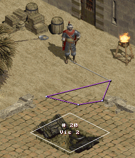

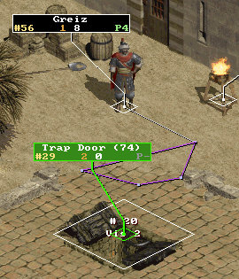

Here is the Trap Door that we'll use in the Rogue Encampment and the Graveyard to connect them.

This Warp is composed of 2 elements : an invisible Vis (here the Vis 2), and the Trap Door object over it, right in the middle.

  

There's just 1 problem : the Trap Door is an object of Act 2, and we want to use it in Act 1. We'll solve this by using an object of Act 1 and replace it by the Trap Door datas. We'll use the Inactive Cairn Stone. Of course that means that if you don't edit the file Data\\Global\\Tiles\\Act1\\Outdoors\\Cairn2.ds1 then when the player will go into the Stony Fields he'll find a Trap Door instead of the Stone , so you'd better have to edit the ds1 and remove that object :

We won't do the change in this tutorial, as it is left as an excercise to the reader, but to help you a bit, this .ds1 LvlType.txt ID is 2, and its LvlPrest.txt DEF is 160.

Now, let's edit our .txt :

*   As you can see on a precedent screenshot the Trap Door is ID 74. So, in Objects.txt, let's go to the line that has ID 74. It's the line 76 in MS-Excel, its name is TrappDoor, so no error, that's the good one.The Inactive Cairn Stone is ID 22 (StoneTheta), so copy the entire row of the Trap Door and paste it over this row that have ID 22.

*   Now in ObjType.txt, copy the Trap Door row onto the Stone 6 row (line 76 onto line 24 in MS-Excel). Save and Close ObjType.txt.

*   Finally, in the data\\obj.txt that you'll find in the win\_ds1edit directory, made the corresponding changes. You don't \*have\* to do it to make it works in the game, but it's better if we're in sync. A search for "Trap Door" in obj.txt gives the line 272 (Trap Door (74)), and a search for "Theta" gives the line 73 (Cairn Stone, Theta (inactive) (22)). So, copy the entire row 272 onto the row 73, and don't forget to change these columns back to their original values :

> *   Act    =  1
> *   Type \=  2
> *   Id     = 11
> 
> Close and save obj.txt.

  
You now have a working Trap Door in Act 1, but no more Inactive Cairn Stone.

**Trap Door in Town and Graveyard**

In the win\_ds1edit directory, put the files Gravey.ds1 and TownE1.ds1. Let's make 2 .bat to open them with the editor.

Graveyard.bat :

> @echo off  
> win\_ds1edit Gravey.ds1 2 108 > log.txt 

TownE1.bat :

> @echo off  
> win\_ds1edit TownE1.ds1 1 1 > log.txt

Launch the Graveyard.bat and you're now editing the Graveyard :

 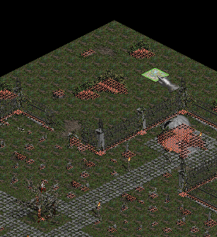

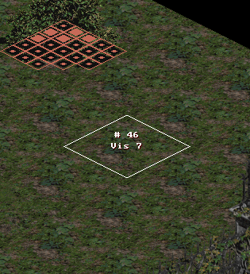

First, press the Space key, in order to be able to view the walkables infos, this help to choose a good place. We'll place our Trap Door here, at Cell 5, 2 (check the coordinates on the bottom / left corner of the screen).

Right-click , press the Wall 1 button, click on the Special button, choose a Vis 7 and press the OK button. It has a problem tough : to avoid a Green Tile to appear in the game, we have to make this one Invisible, since it don't use any graphics.

 

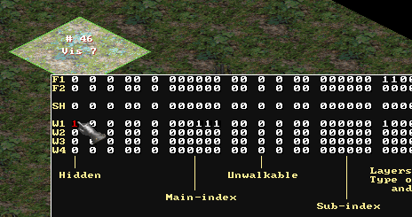

Press Shift + Ctrl + Right-click and we're in the Expert Tile Editing window. Here, since  
our Vis is on the Wall Layer 1, we set the Hidden bit of the line W1 to 1. Then press OK.  
We now have an invisible Vis in the game, so the infamous Green Tile won't appear.  
All that left is to place the Trap Door object itself onto this Special Tile.

 

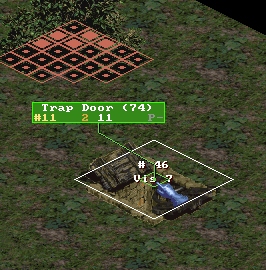

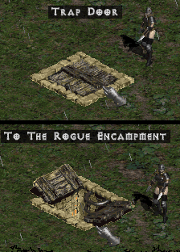

Press Tab to go in Objects Editing mode, place the cursor in the middle of the Tile, press Insert and change the new object (with a right-click on the label) to be the Trap Door we have made before (Act 1, Type 2, Id 11 in the ds1).  
Press Ctrl + S to Save, then Esc to Quit.

Here are 2 screenshots of this  
new Warp, in-game.

  

Note : that's because the Trap Door in Objects.txt has the column OpenWarp set to 1 that we can read the warp destination, but it isn't required : if you set this column to 0, then the trap Door will still work, but when selected its description will stay "Trap Door" instead of "To The Rogue Encampment", which can be usefull if you want to easily hide the destination name.

Now, let's do the same for the Rogue Encampment. Launch the TownE1.bat :

 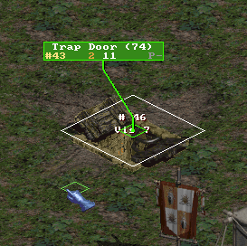

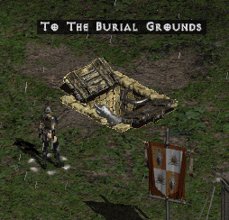

Go to Cell 25, 20, and as for the Graveyard place a Vis 7 there, makes it invisible, place the Trap Door object over it, Save and Quit.

This will be our Trap Door warp in Town.

  
Since we'll test soon that these 2 trap Doors are working, copy TownE1.ds1 into your Mod directory, at the location Data\\Global\\Tiles\\Act1\\Town, and Gravey.ds1 at the location Data\\Global\\Tiles\\Act1\\Graveyard.

**Connect Act 1 Town to Graveyard**

Here's now your Golden Rule :  
  

* * *

**All the Vis present in the ds1 MUST be defined in Levels.txt**  

* * *

If we were trying our Mod now, before any Levels.txt editing, this Assertation would arise :

> Assertion Failure  
> Location : D2Common\\DATATBLS\\LvlTbls.cpp, line #1047  
> Expression : Error in DRLG related to stairs that connect levels

If this assert appear, check carefully all your ds1, write down the Vis numbers they're using, and in Levels.txt check that all of these Vis are linked to the correct level, using the correct Vis.

So, now let's edit Levels.txt, in order to link these 2 Trap Doors together. Go to your Mod directory, and open Data\\Global\\Excel\\Levels.txt there in Excel.

*   The Rogue Encampment is the line with Id 1 "Act 1 - Town", as you can verify if you check the column LevelName btw. 
*   The Graveyard is the line with Id 17 "Act 1 - Graveyard"  
    

If you don't link the Levels together correctly, this assertion can popup :

> Assertion Failure  
> Location : D2Common\\DRLG\\DrlgRoom.cpp, line #604  
> Expression : hDungeonRoomOther

With this one check in Levels.txt that you don't have linked a Vis to the wrong other Level : to be correctly linked, 2 levels must referenced each others. If you link the Vis 7 of Act 1 Town incorrectly to the Crypt, instead of the Graveyard, then this error appear since the Crypt is not referencing Act 1 Town in all its Vis.

Note : this can also have another meanings, as this part of code seems to make several type of checks. You need to know that the last column and the last row of tiles in a ds1 are not used by the game (they're overlapped by their adjacent ds1 at run-time). So if you try to put the Trap Door in the Cell 24, 0 of the Graveyard (the far right corner), since it's a forbiden place, the game can't place the Vis here, and this Assertion comes.

In addition, some Warps are composed of more than 1 Tile, like the stairs of the Caves for instance, so even if the Vis itself is not on a forbidden place, maybe one of the tiles that are changed at run-time for making the cave stairs hilighten \*are\* on such a forbidden place. So, as another rule :  

* * *

**Don't place Vis too close of the Borders of the ds1**  

* * *

What we want is to connect our 2 levels together, using our new Vis. Here, we have created the exact same Vis number (7) in the 2 ds1, but it's not required, it just helps us to keep things organized.

*   In the Vis7 column of the "Act 1 - Town" line, put the Id of the Graveyard (17).
*   In the Vis7 column of the "Act 1 - Graveyard" line, put the Id of the Act 1 Town (1).

This has taken care of the link between the 2 levels, but not the warps themselves. Vis are for the logical connection between levels (the columns Vis0 to Vis7), but all of these Vis have their corresponding Warp columns (Warp0 to Warp7). These Warps columns are ID of a line in LvlWarp.txt. 1 Warp in this .txt define the orientation of the warp, the area where the mouse must be in order to activate the warp, and it indicate if the game must replace some tiles at run-time to hilight the warp.

For us, it's easy. Since we have used the Trap Door of Lut Gholein, we just have to use the same Warp index. Check in Levels.txt the line "Act 2 - Town" (Id 40). The Invisilbe Vis under the Trap Door was a Vis 2, so get the value in the Warp 2 column, here 19. So, for the Act 1 Town and the Graveyard, put 19 in the columns Warp7 of these 2 levels.

If you forgot to set a Warp column (and therefore left it to \-1), then you can have this assertion :

> Assertion Failure  
> Location : D2Common\\DRLG\\DrlgVer.cpp, line #109  
> Expression : FALSE

If you have a Vis, then you must fill its corresponding Warp column as well.

We have added Warps to the 2 ds1, we have filled their Vis and Warp columns, now we can test. Just use the usual \-direct -txt method, and with any Player go in the Act 1 Town, and the Trap Doors should work in both ways, without any warning or error. Don't try to go outside of the Town tough, since you're likely to have a bridge that go to a black wall : we have forced the use of only 1 ds1 for the 4 Town variations, so there's only 1 possible way... But there's a trap Door anyway, so you can escape.

This zip contains the files necessary to test our modifications so far : **[trap\_door.zip](#)** (52 KB). You'll find the ds1 of the Rogue Encampment and the Graveyard, and the 4 .txt of the game we have modified. It's a normal Mod that needs the -direct -txt method.

**A new Tent Warp**

This is taken from an idea of Kingpin, from [**this topic**](http://d2mods.com/forum/viewtopic.php?t=14484) in a Phrozen Keep forum.

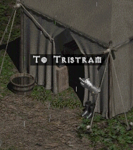

As you see it's possible to make Warps from any elements of the maps. Here, not only we will recreate this warp, but we'll also improve it, as we'll make our own warp settings : area where the mouse must be to activate the warp, exact position of the warp to enter it, and location where the player is heading to when he 's coming out of the tent.

To make our own warp, we'll use LvlWarp.txt. We can add our own warps in this file, and once you understand what the columns are for it's not very hard to make them.

But before doing any .txt editing, let's find what will be our settings for this warp.

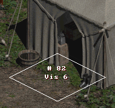

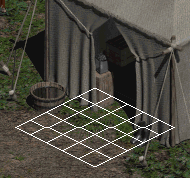

First, let's use the Ds1 Editor. Place a Hidden Vis 6 of orientation 11 on the Wall layer 2, exactly here. Move the Rogue and the Torch objects to somewhere else, Save, press the P key to take a screenshot, and Quit.

Open this screenshot in an image editor, like Paint Shop Pro. In the game a Tile is a group of 5 x 5 sub-tiles, as this screenshot show.  
  
We now have to decide which sub-tile will be our base : this is the sub-tile where the player appear when he exit the warp.

 

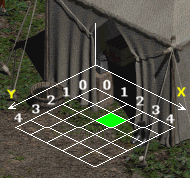

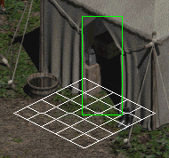

It's better if we choose the center of the tent entrance, on the ground level, so, here, let's choose this one, at coordinate 2,1 in the sub-tile coordinates system of this Tile.  
  
Note : this sub-tile can be far away of the Vis, not necessary inside the Special Tile. The warp Act 2 Sewer Dock to Town is like that.

Let's define the sensitive area we want for the tent warp. We draw a box that include exactly the tent entrance.

 

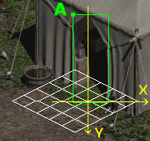

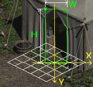

If we take the bottom of the Base sub-tile as a reference, and consider it the base of the mouse coordinates system, then the upper / left corner of the mouse area is the point A, at coordinates \-20, -111, in pixels.

The Width (W) and the Height (H) of  
the box is 46 x 112 pixels.

  
 

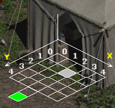

The last data we need is the location from the **base** where the player  
will head to, when he'll exit the tent. Here, we'll make him walk to  
sub-tile 0, 5 from the base. We can make it far away, but in any case  
the Player has the possibility to stop the auto-walk by clicking elsewhere.

We can now edit LvlWarp.txt, since we have all the infos we need to make a new warp.

In this file, if we check carefully, we'll see that all warps have the column Direction set to b, except some of the Expansion, which have l and r. Coincidently, the warps that don't have b are a pair of warps with the same Id, but one with Direction l, the other with r. So, l stands for Left, r for Right, and b for Both. The Orientation of the Vis (10 or 11), will be used by the game to know which one of these 2 lines it'll use : if the Vis is an Orientation 10, this will be the line with the l Direction, else if it's a Vis of Orientation 11, the game will choose the line with the r Direction.

Note : if you create a Warp that don't use the Direction b, then be sure to make 2 lines in LvlWarp.txt for this warp Id, one for the Left, one for the Right, else this assertion (that we already described before) will arise :

> Assertion Failure  
> Location : D2Common\\DATATBLS\\LvlTbls.cpp, line #1047  
> Expression : Error in DRLG related to stairs that connect levels

This time it's indicating that it can't find the warp data in LvlWarp.txt, either because the Id is just not present, or because the expected Direction is not present.

To create a new warp, go to the bottom of the file, and in the first empty row edit the columns like this :

Name

 = 

Act 1 Small Tent R

                         

OffsetX

 = 

2

Id

 = 

83

 

OffsetY

 = 

1

SelectX

 = 

\-20

 

LitVersion

 = 

0

SelectY

 = 

\-111

 

Tiles

 = 

2

SelectDX

 = 

46

 

Direction

 = 

b

SelectDY

 = 

112

 

Beta

 = 

0

ExitWalkX

 = 

0

 

 

 

 

ExitWalkY

 = 

5

 

 

 

 

The column Name is not used by the game, but it's better to have a good description.

Here we have set the column Direction to b, because even if we know that it is definitively for a Right entrance, it'll avoid some possible assertion later, if you use this warp ID with a Vis of Orientation 10 by mistake for instance.

The column LitVersion is used by the game to know if it has to replace some tiles of a warp at run-time by their hilightened version. Si nce we don't have such graphics for our tent, we set it to 0, this avoid some glitchs, like part of the tent changing to mud when the mouse is over the entrance. Anyway, the hilight process is hardcoded, and linked to the warp Id, so unless you're doing DLL editing, never use a LitVersion of 1 when you create warps with a new Id.

**1-way Warp to Tristram**

We'll make the Tent connected to Tristram, but without turning back, just to show that it's possible (and easy) to do.

First, put the Tri\_Town4.ds1 in the Ds1 Editor directory, and make this .bat ;

Tristram.bat :

> @echo off  
> win\_ds1edit Tri\_Town4.ds1 11 300 > log.txt

Launch it, and at cell coordinates 10, 38 place an Hidden Vis 6 on Wall layer 1, delete the Fallen object that's near, then place 1 non-selectable object on the Vis (here, just a light), and just for fun place some Fog Water around the Vis like in this exemple, to make it looks like a special area :

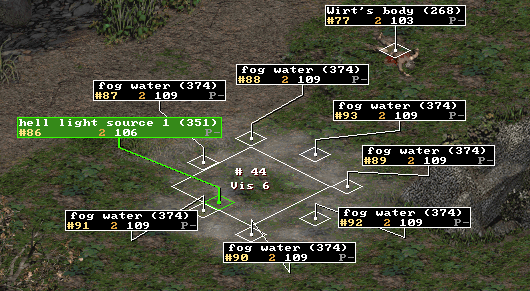

As you have noticed, it's the same process as the Trap Doors we have created before, except that the Object on the Vis is different. If you don't put any Object on the Vis, then the Warp will still work, but it'll be selectable by the Player, something we don't want here. So we place an object, but the trick is that the object is not selectable, so despite the Warp IS working, since the Player is unable to select the object, he can't activate this side of the Warp, so it's a 1-way warp :

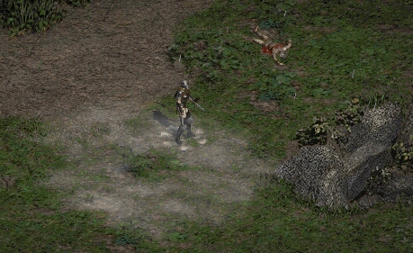

Now, let's test our new Warps, from the Rogue Encampment to Tristram. Open Levels.txt in Excel. The Act 1 Town is still the Level Id 1, Tristram is the Level Id 38, we have used 2 Vis 6, for the Warp 6 in Town we have created our own Warp, and for Tristram the Vis 6 will be like the Trap Door.

*   Act 1 - Town :
    *   Vis6 \= 38 (to Tristram)
    *   Warp6 \= 83 (our new Tent entrance warp Id from LvlWarp.txt)  
          
        
*   Tristram :
    *   Vis6 \= 1 (to Town)
    *   Warp6 \= 19 (Trap Door)

In your Mod directory :

*   in the Data\\Global\\Tiles\\Act1 directory, create the Tristram directory and place Tri\_Town4.ds1 inside.  
      
    
*   Place the new version of TownE1.ds1 in Data\\Global\\Tiles\\Act1\\Town.  
      
    
*   LvlWarp.txt should be in your Data\\Global\\Excel directory.

You can now test this Mod, and the Rogue encampment's Tent to Tristram's Fog Warp. The Trap Door between the Town and the Graveyard is of course still working.

This zip contains the files necessary to test our modifications so far : **[tent.zip](#)** (56.1 KB). You'll find the files of the trap\_door.zip with the new and updated files we have made since.

**A new House in Town**

We'll add a House in the Rogue Encampment, one with Roofs that disapear when you walk inside. It's not very hard, but we have to take care of some details else it won't work.

First, don't build them from scratch, always take a model, because in order to have Roofs that disapear, you have to use and place specific special tiles, and the details of how these ones are working is still unknown. So, we'll take the file Data\\Global\\Tiles\\Act1\\Outdoors\\Cott1.ds1 as a model.

Since we want to copy / paste the house in another ds1, we have to load 2 ds1 at once in the ds1 editor, which is done by a .ini that we use as a parameter to win\_ds1edit.exe :

Cottage and Town.bat :

> @echo off  
> win\_ds1edit cottage\_town.ini > log.tx t 

cottage\_town.ini :

> 2 47 Cott1.ds1  
> 1 1 TownE1.ds1  

Place Cott1.ds1, this .ini and this .bat in the directory of the ds1 editor, then launch the .bat. Select the house, press the keys Ctrl + C to copy it, press the key 2 to view the 2nd ds1 and ... damn, where's the house ? What are these weird tiles ?

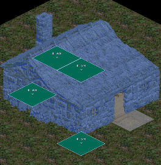

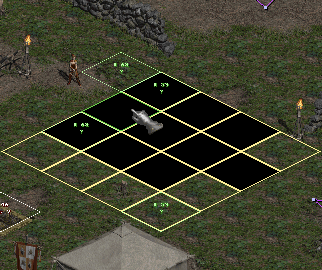

Select the house, and copy it

Try to paste it in the other ds1,  
and bad things happens

We forgot to edit LvlTypes.txt : This file contains several lists of DT1, and our Rogue Encampment don't use yet the graphics of the Cottage house. Before beeing able to use the cottage tiles, we have to include them to the list of the active DT1 of this ds1.

Take LvlTypes.txt and place it into the Data\\Global\\Excel directory of your Mod directory. Then open it with Excel. The Rogue Encampment ds1 is using the LvlType 1. It already have some DT1 like Act1/Town/Floor.dt1, Act1/Town/Fence.dt1, Act1/Town/trees.dt1... but nowhere a cottage.

The Cott1.ds1 is using the LvlType 2 (Wilderness), and here we can find a cottage : the column File25 of the LvlType 2 row has the dt1 Act1/Outdoors/Cottages.dt1. Copy this filename, and paste it into a free slot of the LvlType 1 row, here in the File7 column, you can now save and close this file.

We have added a gfx to the DT1 list of the Town... but it won't use it yet. We have just added the \*possibility\* for this ds1 to use it, we didn't set the ds1 parameters to actually use it. This is done in LvlPrest.txt, with the column Dt1Mask. This column is a bitfield. We currently find the value 959. In binary this value is 1110111111. There are 32 bits maximum, and we have 32 columns File, from File1 to File32, each bit indicate if the ds1 is using the filename in the corresponding column. If we read the bits from the lowest to the highest (from right to left), we'll find that this ds1 is using the columns File1 to File10, except the File7 (which had a 0 before we add our cottage dt1 in there, so that's why).

Let's add the column File7 to this Dt1Mask. Each column is a power of 2. File1=1, File2=2, File3=4, File4=8, File5=16, File6=32 and finally File7\=64. So we add 64 to 959, and our new value is 1023. Replace 959 by 1023 in LvlPrest.txt, save and close the file. If you don't like doing it manually, you can use this tool to help you : **[dt1mask Maker v1.0](http://phrozenkeep.hugelaser.com/filecenter/dload.php?action=file&file_id=129)**.

Now we're ready. Launch again the Cottage and Town.bat , make some place in Town, copy/paste the house (floor + walls + special tiles) into town, save, quit, and we're done with the editor :

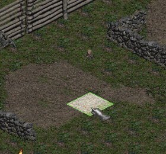

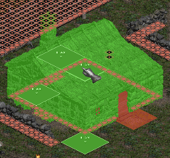

Near Charsi, remove the Vehicle, the Rogue and the Chicken, to make some place

You can now safely copy / paste the house right there.

Save and quit, and place the new TownE1.ds1 into your Mod directory, at its usual Data\\Global\\Tiles\\Act1\\Town place. We can now test the house in game :

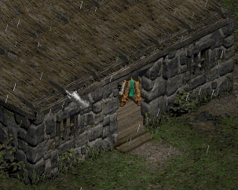  
Hmmm, the house is there but the Roofs are not disapearing...

It seems we forgot something but what ? Open LvlPrest.txt, make a search for "cottage", and you'll find the line Act 1 - Cottages 1 at Def 47. If we now compare 2 columns, the Pops and PopPad, we'll see that the Town is not using them, while the Cottage house does. Just copy/paste these 2 values in the row of Town (Pops = 2 and PopPad \= \-4), and the house will finally works as expected :

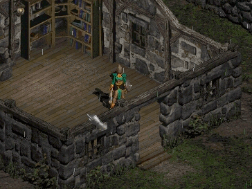

The meaning of the columns Pops and PopPad is not well know, but at least it's clear they have something to do with Areas of Tiles that disapear when the player walk somewhere (presence and count of areas / special tiles). That's why it's important to always follow a model, because we can't yet guess these values from scratch.

This zip contains the files necessary to test our modifications so far : **[house.zip](#)** (58.3 KB).

To be continued....