**Adding ANY Monsters and ANY Objects to a DS1**   
by **Paul Siramy** - May 2010  

**Table Of Content :**

*   [Overview](#)
*   [Hardcoded tables in DLL](#)
    *   [Type 1 units](#)
    *   [Type 2 units](#)
*   [Softcoded Type 1 table in the patch 1.10](#)
*   [Adding a SuperUnique Monster to a DS1](#)
*   [Adding a regular Monster to a DS1](#)
    *   [First method (direct index)](#)
    *   [Second method (indirect index)](#)
*   [Adding an Object to a DS1](#)

**Overview**

This tutorial will explain how to add any Monster and any Object of any Act into any DS1, dealing only with Diablo II T XT as well as my DS1 editor, without DLL editing. Since the 1.10 patch, it is now possible to use a new and very interesting functionality. **TeknoKyo** discovered how the Type 1 units (Monsters/NPC) were now working, and **SVR** did the same with the Type 2 units.

**Hardcoded tables in DLL**

In a DS1 you can find 2 kind of units. The Type 1 units are Monsters/NPC, taken from Data\\Global \\ Excel \\ MonStats.txt , Data\\Global\\Excel\\ MonPlace.txt, and Data\\Global\\Excel\\SuperUniques.txt. Each Type 1 units can have Paths. The Type 2 units are Objects, taken from Data\\Global\\Excel\\Objects.txt, such as Chest, Shrine, Torch...

In D2Common.DLL (before patch 1.10) we can find 2 tables, one for the Type 1 units , the other for the Type 2 units . Both contains indexes, and are split into 5 parts, one for each act.

The Type 1 hardcoded table is composed of 60 entries per act, so since we have 5 acts this table has a total of 300 indexes. The Type 2 hardcoded table is composed of 150 entries per act, for a total of 750 indexes.

Here's an extract of the start of the Type 1 table :

> 

In a DS1 the Type 1 units are using an index. This is NOT directly the **hcIdx** you can find in MonStats.txt, it's in fact the entry number in this Type 1 table. For instance, if in a DS1 of act 2 you put a Type 1 unit with ID 2, the game will take the Type 1 unit table, and check the entry # 2 of act 2 (here the entry noted "62" in the image). The index value at this entry is 177, so the game will use the Monster with hcIdx 177 from MonStats.txt, which is a NPC : _Drognan_.

**  
Type 1 units**

In all the original DS1 of the game, each Type 1 unit are using ID which range from 0 to 59. This is the Act value inside the DS1 that indicates which one of the 5 possible parts of the Type 1 table the game will look into :

*   Act 1 = entries 0 to 59
*   Act 2 = entries 60 to 119
*   Act 3 = entries 120 to 179
*   Act 4 = entries 180 to 239
*   Act 5 = entries 240 to 299

This also means that, normally, one DS1 can have access to only 60 different Monsters/NPC. But up to the 1.09d patch it was possible to use a useful trick to make one DS1 have access to all 300 Monsters/NPC of the entire Type 1 table : you simply had to used an ID that was out of the legit bounds (lower than 0, or greater than 59).

> For instance, if in an Act **2** DS1 (which use entries 60 to 119 in the table) you placed a Type 1 unit with an ID of -14, then the game was looking in the Act **1** part of the Type 1 table instead of the expected Act 2, and took the entry 46 (60 - 14 = 46), which has the value 652. For some reasons this is not the Monster with hcIdx from MonStats.txt (bloodlord6), but a SuperUnique Monster (_Corpsefire_).  
> 
> Another example : in the same Act 2 DS1, a Type 1 unit with an ID of 62 would have make the game use a Monster/NPC of Act 3 (not Act 2), and it'd be the entry 122 in the Type 1 table : Act 2 start at entry 60, 60 + 62 = 122, 122 is in the range of Act 3 units.

You have to know that the 1.10 patch changed that behavior, and this trick don't work anymore, but we'll see that in details later.

  
**Type 2 units**

This table has 150 entries per act, so in a DS1 each Type 2 unit has an ID that range from 0 to 149. As for the Type 1 units, the ID are NOT directly the Id from Data\\Global\\Excel\\Objects.txt but the entry number in the Type 2 table for the Act of the DS1. Up to the 1.09d patch you were able to use the same trick idea, except that there was a check in the DLL that prevent it working exactly the same : you were able to use Objects of precedent Acts (with a negative ID), but it was impossible to use an ID greater or equal than 150, making it impossible to use Objects of later acts. The workaround was to always use a DS1 of Act 5, since it gave the access to all the Objects contained in the Type 2 table.

**Softcoded Type 1 table in the patch 1.10**

The patch 1.10 (in fact it was there from the beta release, 1.10s) gave us a new level of flexibility for Type 1 units, as it introduced a new TXT : Data\\Global\\Excel\\MonPreset.txt. It also introduced Data\\Global\\Excel\\MonPlace.txt, but this one is better left out. MonPreset.txt can be seen as the original table from which the hardcoded Type 1 table has been made.

In MonPreset.txt, there are 47 entries for the Act 1. As you can see in the precedent image, the first 4 entries have the values 147, 146, 148 and 149. In MonStats.txt the Monsters/NPC with these **hcIdx** are : _gheed_, _cain1_, _akara_ and _chicken_. Coincidentally, in MonPreset.txt the first 4 entries for Act 1 are exactly these 4 codes. This makes it clear that the old Type 1 hardcoded table is not in the DLL anymore, but is now accessible in a TXT.

The good thing about the Type 1 table being a TXT table is that you can edit the entries very easily (not recommended tough), but also \***add**\* new entries. And you're not limited to 60 Monsters per Act now, you can put in one Act the entire list of the Monsters/NPC from MonStats.txt and all the SuperUnique Monsters if you want !

A drawback is that 1.09 DS1 that used the trick of placing Monsters of another Act (with the help of ID out of bounds) are not compatible with the 1.10 patch, so you have to edit all these 1.09 DS1 to convert them into 1.10, else unexpected Monsters/NPC will spawned in these DS1.

**Adding a SuperUnique Monster to a DS1**

Let's say that you want to use a SuperUnique Monster at the Den of Evil's entrance, one that you either created or one that simply not belongs to the Act 1 usually. For SuperUnique monsters (monsters found in SuperUniques.txt) you have no choice, you \*have\* to use MonPreset.txt. For regular Monsters/NPC (found in MonStats.txt) we will use another and more simple method, that we'll see later.

First, we have to make this SuperUnique monster available for any Act 1 DS1. So we edit MonPreset.txt and add a new row at the end of the act 1 entries. Let's say that we'll use _Frozenstein_, found in Act 5 normally, MonPreset.txt will then looks like this :

> 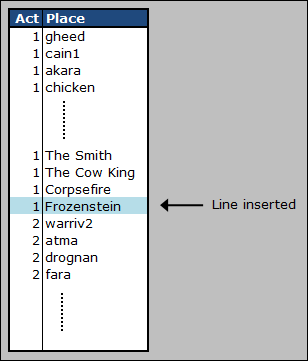

For the game, this is enough to make this SuperUnique monster available for any DS1 that use Units of Act 1. But if you want to put that monster into a DS1 using my DS1 editor, you have to edit another file.

In the DS1 editor directory, go into the Data sub-directory, and edit the file Obj.txt in MS-Excel or any similar program. This file tells the editor which units you can place into a DS1, and to avoid problems it should be the reflect of the game's files. Here, we already have some rows below _Corpsefire_, still in Act 1 (from Id 47 to Id 59) :

> 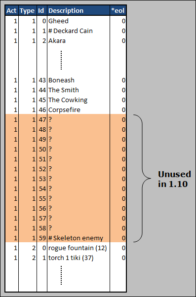

They are unused entries of the 1.09 patch where the Type 1 hardcoded table was 60 entries per Act. In the 1.10 patch however, these entries have no meaning anymore.

You have to make the Type 1 units of the DS1 editor's Obj.txt be the exact reflect of MonPreset.txt so, as you did for MonPreset.txt, place _Frozenstein_ right after _Corpsefire_, **inserting a new row if needed** (and adjusting the Id column), which is not the case here so just replace the first unused row. Your Obj.txt should now looks like this :

> 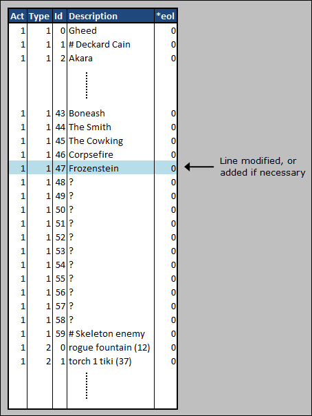

The important columns are **Act**, **Type**, **Id** and **Description**, as the others are only graphical datas to display an animated sprite into the Editor, which is only optional. Don't forget to add a **0** (zero) in the column **\*eol** column tough, this is to ensure that Ms-Excel will save the file correctly.

You are now able to add _Frozenstein_ to the entrance of the Den of Evil DS1. There are 2 files (as there are 2 variations), both in d2data.mpq, in the directory Data\\Global\\Tiles\\ACT1\\CAVES. The DS1 files are denent.ds1 and denent2.ds1, using both a LvlPrest 52 and a LvlType 2 :

> 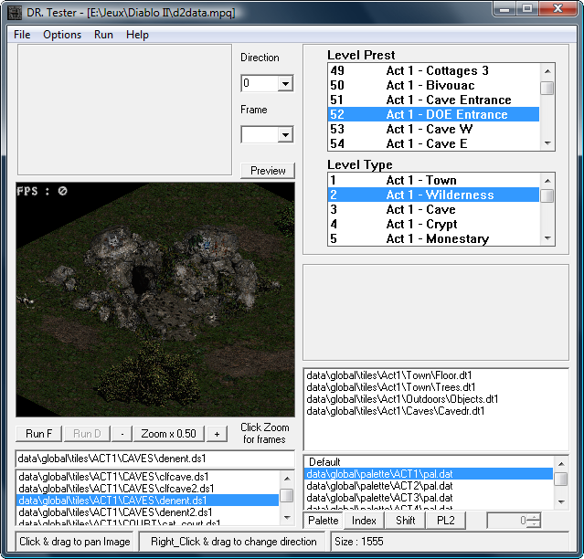

In the DS1 Editor, INSERT the object _Frozenstein_ near the entrance, in both DS1 files :

> 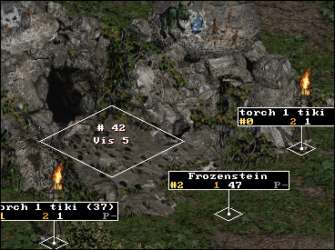

Run the game in \-direct -txt mode, go to the Den of Evil, and here's the result :

> 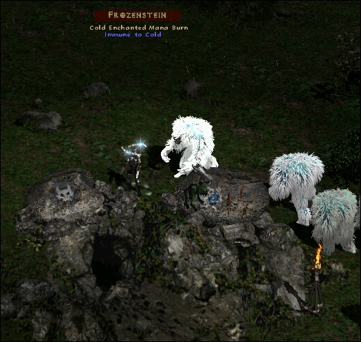

ZIP file with the relevant modded files to place _Frozenstein_ at the entrance of the Den of Evil : [doe\_frozenstein\_1.13 example files](../04-Examples/Doe-Frozenstein-Example/). It contains these 3 files :

*   Data\\Global\\Excel\\ MonPreset.txt
    
*   Data\\Global\\Tiles\\ACT1\\CAVES\\denent.ds1
*   Data\\Global\\Tiles\\ACT1\\CAVES\\denent2.ds1

with the TXT file taken from patch\_d2.mpq, Patch 1.13.

**Adding a regular Monster to a DS1**

When you want to add in a DS1 a monster that is present in MonStats.txt (not in SuperUniques.txt), you don't have to place it's **Id** in MonPreset.txt, you can use a new functionality of the 1.10 patch :

In a DS1, a Type 1 unit that has an ID which don't represent a valid row in MonPreset.txt is considered as the **hcIdx** in MonStats.txt.

This is how you can place in a DS1 of any Act \*almost\* any Monster/NPC present in MonStats.txt : _QuillRat_, _BloodLord_, _Larzuk_, _Radament_, _Diablo_... As for the "almost" part : The monsters at the start of MonStats.txt which have a **hcIdx** that represent a valid row in MonPreset.txt can't be accessed using this method, because the monsters defined in MonPreset.txt will be take instead. So if you really wanted to place a monster with such a low ID, then put its code (**Id** column from MonStats.txt) in MonPreset.txt as you would do for a SuperUnique monster.

In the un-modded 1.10 patch, MonPreset.txt has 47 entries for Act 1, their indexes ranging therefore from 0 to 46. So, in a DS1 that use Act 1 units, a Type 1 unit with an ID of 46 will be _Corpsefire_, while a Type 1 unit with an ID of 47 will be the Monster/NPC with **hcIdx** 47 in MonStats.txt : _FleshHunter_.

In our precedent example, we have added a new row to the Act 1 of MonPreset.txt, _Frozenstein_. In that case then, in a DS1 that use Act 1 units, a Type 1 unit with an ID of 46 will still be _Corpsefire_ as expected, but another unit with a Type 1 ID of 47 will be _Frozenstein_ and not _FleshHunter_ any more. A Type 1 unit with an ID of 48 will be taken from MonStats.txt, and this will be the Monster with hcIdx 48 : _DuneBeast_.

Here's a diagram that show the logic, for the un-modded 1.10 patch (original MonPreset.txt to be more specific). In the Act 2 part of MonPreset.txt, we find 59 rows, so the IDs, there, are ranging from 0 to 58. In a DS1 that use Act 2 units, a Type 1 unit with ID 58 will be found into MonPreset.txt (row #58 = skeleton5), but another with ID 59 is a row that is not in MonPreset.txt, so the game will looks into MonStats.txt instead, and the Monster with **hcIdx** 59 (_CarverShaman_) will be used :

> 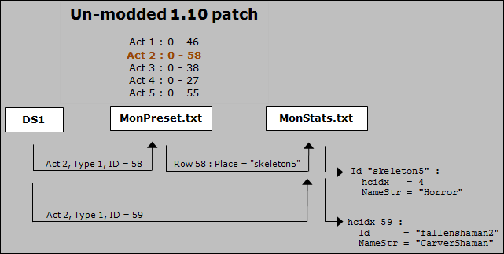

  
If you want to place _Diablo_ in a Act 3 DS1, since he is **hcIdx** 243 in MonStats.txt (greater than 38 then), you have 2 solutions :

*   Direct index : In the DS1, place a Type 1 unit with ID **243** 
*   Indirect index : In MonPreset.txt, in the Act 3 part, put _diablo_ in the **Place** column, and in the DS1 put a Type 1 unit with an ID that is the row of _diablo_ in MonPreset.txt , Act 3 part. If you didn't add entries to the act 3 part of MonPreset.txt yet, it'll be the row 39, so in the DS1 put a Type 1 unit with ID **39**.

Both methods will work, so it's up to you to decide which one to use. None will prevent you to corrupt your DS1 if you delete or insert rows in MonPreset.txt and/or MonStats.txt so, as often as possible, just **add** entries to these files to avoid you the need to edit the corupted DS1.

Whatever the method you'll choose, you'll have to edit my DS1 editor's Obj.txt to be able to put the Type 1 unit. If you choose the 1st method, put the MonStats.txt **hcIdx** in the Obj.txt **Id** column. If you choose the 2nd method, put the MonPreset.txt row number instead.

   
   
**First method (direct index)**

Insert _Diablo_ in the Obj.txt of the DS1 Editor (Act 3, type 1 list, using MonStats.txt **hcIdx**) :

> 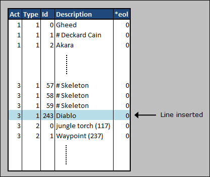

You are now able to add _Diablo_ to the Act 3 Town DS1. The file is in d2data.mpq, in the directory Data\\Global\\Tiles\\ACT3\\Docktown, and the DS1 file is docktown3.ds1, which use a LvlPrest 529 and a LvlType 20 :

> 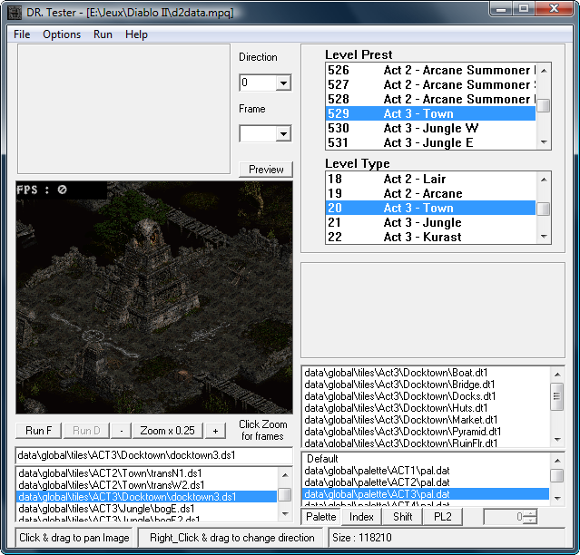

In the DS1 Editor, INSERT the object _Diablo_ where you want :

> 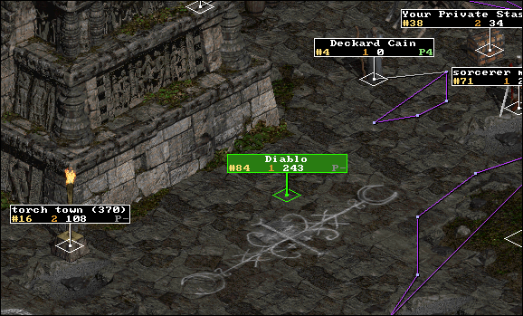

Run the game in \-direct mode, go to Act 3 if needed, then to the place where you inserted your own _Diablo_, and here's the result :

> 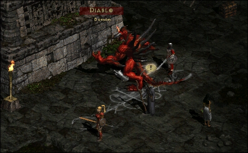

ZIP file with the modified DS1 docktown3.ds1 : [act3\_town\_diablo\_method1 example files](../04-Examples/Act3-Town-Method1-Example/)

**Second method (indirect index)**

Insert _Diablo_ in MonPreset.txt (Row 39 of the Act 3 Type 1 list) :

> 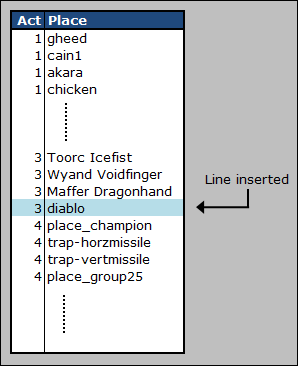

Edit or insert _Diablo_ in Obj.txt of the DS1 editor (Act 3, Type 1 list, using row number in MonPreset.txt) :

> 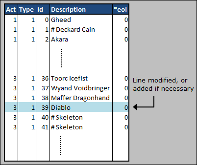

Insert _Diablo_ in the Act 3 DS1, using the DS1 Editor :

> 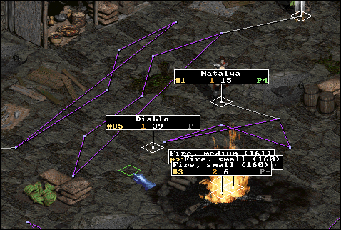

Run the game in \-direct -txt mode, go to Act 3 if needed, then to the place where you inserted your own _Diablo_, and here's the result :

> 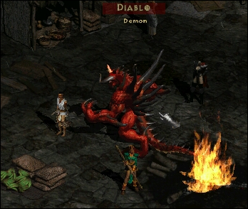

ZIP file with the modified files : [act3\_town\_diablo\_method2 example files](../04-Examples/Act3-Town-Method2-Example/). It contains these 2 files :

*   Data\\Global\\Excel\\ MonPreset.txt
    
*   Data\\Global\\Tiles\\ACT3\\Docktown\\docktown3.ds1

with the TXT file taken from patch\_d2.mpq, Patch 1.13.

**  
Adding an Object to a DS1**

Using a negative ID for an Object still works in 1.10 like in 1.09. This means that a DS1 can have access to all objects of its Act and the precedent Acts, but not later ones.

Now, even if there is no equivalent of MonPreset.txt for the Objects, the possibility to use a greater ID works the same as for Type 1 unit, with one noticeable difference : if the game find in a DS1 an Object with an ID greater or equal than 150, then **it first substract 150** to this value, and then it use this new value and consider it as the ID in Objects.txt. Note that you can't use a Type 2 Object ID of exactly 150, because in Objects.txt the object with ID 0 make the game crash.

Substracting 150 to the DS1 Type 2 ID gives you access to ALL the objects in Objects.txt , not like Type 1 units where you couldn't use the first monsters with a too low **hcidx**.

Let's use different objects of all acts in an act 1 DS1 :

> **Description**
> 
> **Act**
> 
> **Objects.txt ID**
> 
>  
> 
> **DS1 Editor ID**
> 
> Trap Door
> 
> 2
> 
> 74
> 
> \+ 150 =
> 
> **224**
> 
> Lam Esen's Tome
> 
> 3
> 
> 193
> 
> \+ 150 =
> 
> **343**
> 
> Diablo seal
> 
> 4
> 
> 392
> 
> \+ 150 =
> 
> **542**
> 
> Ancients Altar
> 
> 5
> 
> 546
> 
> \+ 150 =
> 
> **696**

Insert the 4 new objects ID in the Obj.txt file of the DS1 Editor :

> 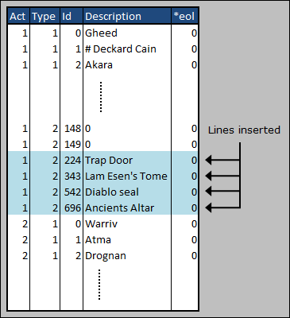

You are now able to add the 4 objects to one of the 4 variations of the Act 1 Town DS1. The file is in d2exp.mpq, in the directory Data\\Global\\Tiles\\ACT1\\Town, and the DS1 file we'll used is townE1.ds1. It's using a LvlPrest 1 and a LvlType 1:

> 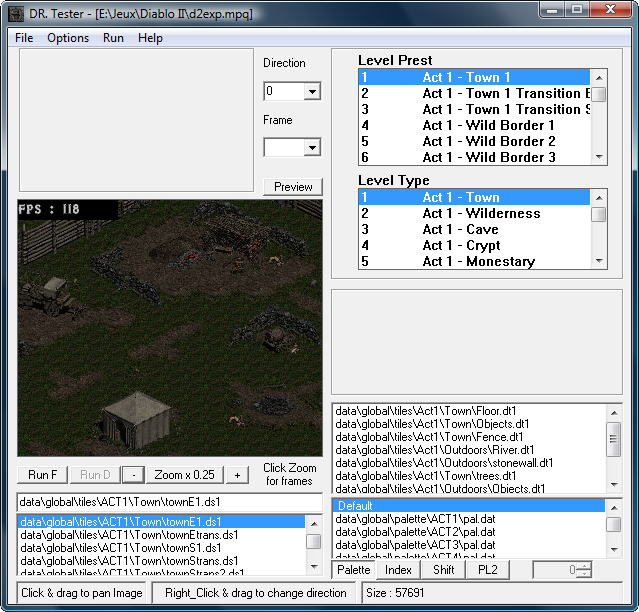

To make it working for our test, edit LvlPrest.txt and force the 4 act 1 town variations to be TownE1.ds1 :

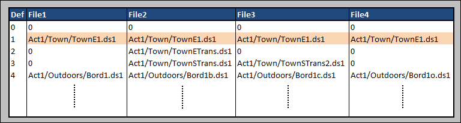

Place somewhere in the Rogue Camp the 4 objects of later acts, in the DS1 Editor :

> 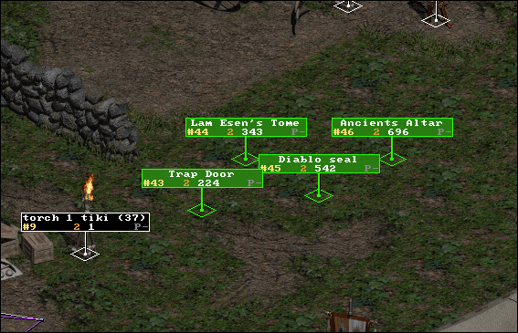

Run the game in \-direct -txt mode, go to the place where you have added the 4 Objects, and here's the result :

> 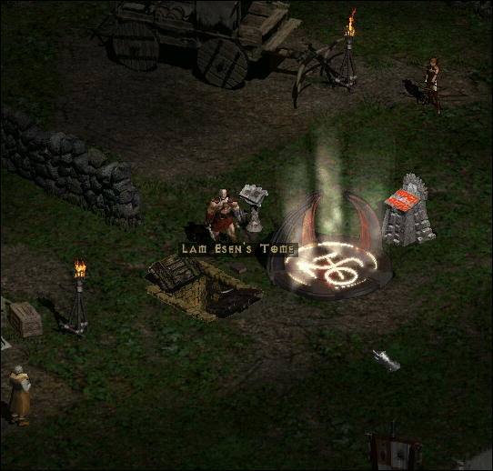

As you can see, the Objects looks like they're working (more or less).

ZIP file with the modified files : [act1town\_4objects example files](../04-Examples/Act1-Town-4Objects-Example/). It contains these 2 files :

*   Data\\Global\\Excel\\ LvlPrest.txt
    
*   Data\\Global\\Tiles\\ACT1\\Town\\townE1.ds1

with the TXT file taken from patch\_d2.mpq, Patch 1.13.